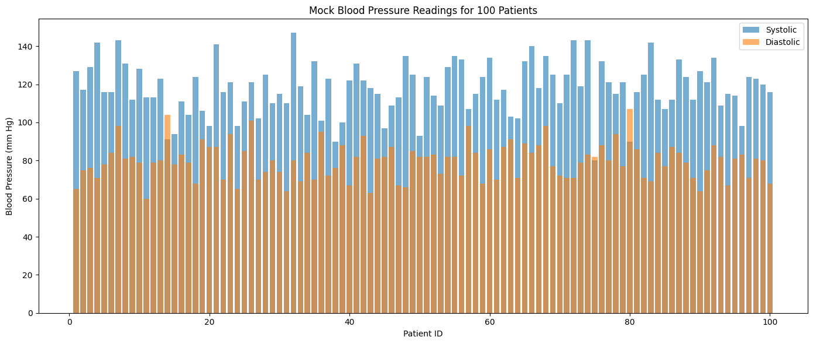

# Overview

## Short Description

Generate and view a histogram for blood pressure readings

## Long Description

This repository contains workbooks and data to analyze blood pressure readings for a patient population. The data provided here is randomly generate and is not drawn from any atual patient population. However, you should be able to swap out different data files

## Workbooks

[BP_Analysis.ipynb](BP_Analysis.ipynb)

### Basic analysis workbook
* BP_Analysis.ipynb
* Visualization.ipynb
* DataGeneration.ipynb

## Data

## Visualizations

## References

This analysis uses the hypertension categories defined in:
https://docs.github.com/en/get-started/writing-on-github/getting-started-with-writing-and-formatting-on-github/basic-writing-and-formatting-syntax
